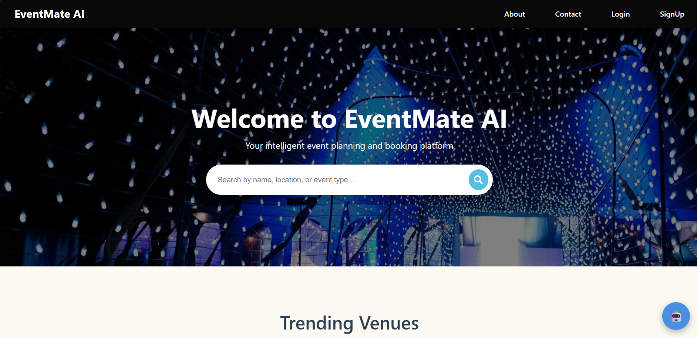
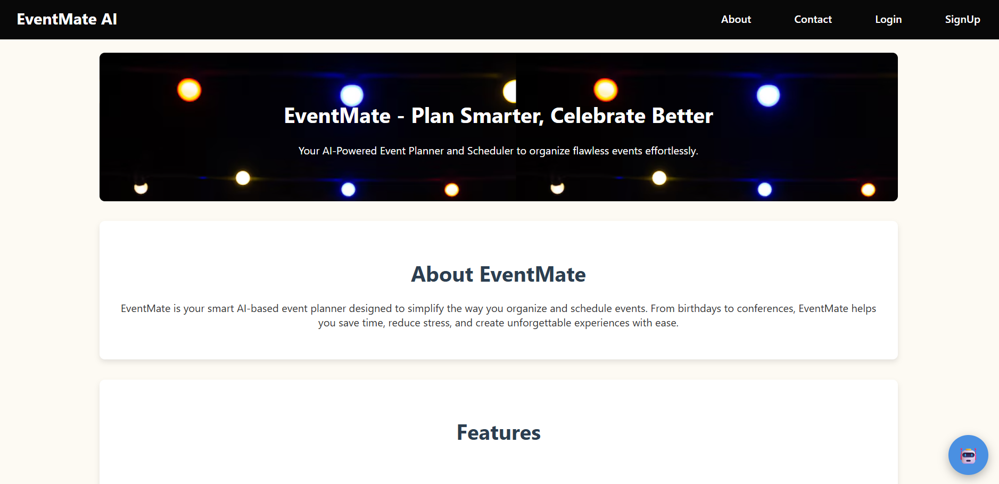
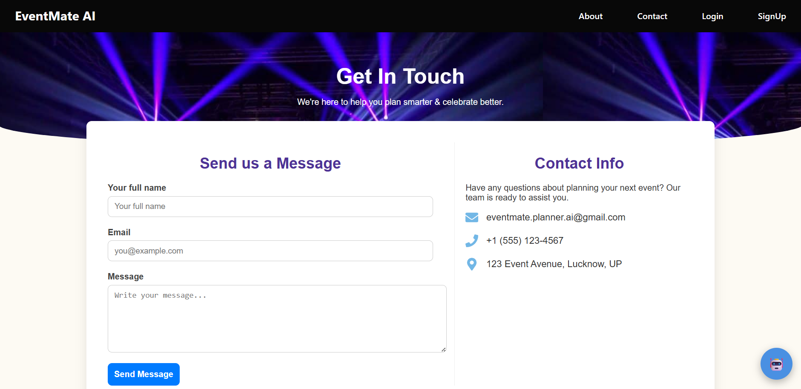

🎉 EventMate - AI Planner and Scheduler

📌 Overview
EventMate is an intelligent event management platform designed to simplify the process of planning, booking, and organizing events. From venue booking to scheduling and coordination, EventMate uses smart automation and an intuitive interface to enhance the experience for both users and event owners.
Developed with a React frontend and Spring Boot backend, EventMate ensures smooth performance, secure data management, and user-friendly interactions.

🎯 Features
✅ User & Admin Authentication
User Login/Register: Secure access for event planners and users.
Admin Login: Manage halls, bookings, and user activities securely.
✅ Smart Hall Booking System
Users can easily view available halls and book them for their events.
Hall owners can monitor and manage all bookings.
✅ AI-Based Event Scheduling
Automatically suggests optimal event dates and times based on user preferences and availability.
✅ Dashboard for Users & Admins
Users can track their bookings and event status.
Admins can oversee all halls, users, and feedback.
✅ Contact & Feedback Options
Users can reach out for support and share their event experiences.
✅ Attractive & Responsive UI
Built using React and CSS for a modern, responsive interface.

🔧 Technologies Used
Frontend: React.js, CSS
Backend: Java, Spring Boot
Database: MySQL
AI Integration: OpenAI API 

🖼️ Screenshots of the Project

📌 Homepage

📌 About page

📌 Contact & Feedback Page

🚀 Future Plans

🔹 Integrate AI-based recommendations for event themes and budgets.
🔹 Implement real-time notifications for bookings and updates.
🔹 Enable online payment gateway for hall bookings.
🔹 Add analytics dashboard for admin insights

💡 Stay Tuned for Updates! 🎉

EventMate continues to evolve with smart automation and user-centric design to make event planning smarter, faster, and effortless!